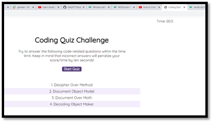
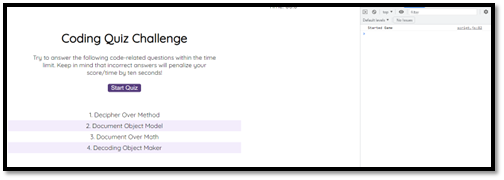
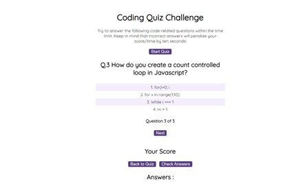

# <Multi Choice Quiz>

## Description

The multi choice quiz required lots of new skills and existing skills to be displayed.

The requirements from the brief where:

To have a start button that when pressed generated a set of questions with a timer.
The questions were multi choice and the user had to select an answer from the choices given. 
Once an answer was given the quiz then moved onto the next question.

If an incorrect answer was given by the user then 10 seconds would be deducted from the time.
The quiz would end once the time counted down to 0.

When the game ended a score would be given and the user could enter their initals so save to a high score board which would be saved to local storage.

Again I really did struggle  with getting the basics right in this task and felt unable to move on because I got confused with how to apply the query selector. I got the count down timer connected to an event listener but could not manage to find a way to display the questions once the start button was press and this took up much of my time and left me unable to complete other parts of the quiz.

I wrote the following pseudo code in the js document to try and help me keep focus.

// pseudocode

/* Initiate button to set timer
show question and choices
(process)when user clicks answer return value true=== || or false===
when false time -10 sec 
when true score +10 points
next question (process)
if timer = 0 go to end-screen
if quiz completed enter initials
show score  (use local server to store scores)

 */

I also set up some tests but did not get very far and I feel that I certainly would have benefited having more time on this task to go through all the elements. Working full time does mean that I only have a limited amount of time to work on the js projects and I feel that the 30 hours I put into coding a week is certainly not enough time.

I got bogged down with query selectors and tried to apply code that would work with the query selector to display texts this became unfruit full despite many attempts. I tried elementById and getInnerText but I could not connect this up with the code to reveal the text. I managed to get the start button to show/hide but this was not the intention.

I then decided to use butttons for my quiz instead of text. I tried to add some code so the data for the high scores was added to the local server but was unable to test this as I did not get as far as I would have liked on this project.

I would like to go back to this challenge and solve it but never seem to get time as the next challenge is always around the corner.

With more time I could have found out why my second and third answers were not responding correctly, tested and improved the timer. I could have added more questions.

 
   

## Table of Contents (Optional)

If your README is long, add a table of contents to make it easy for users to find what they need.

- [Installation](#installation)
- [Usage](#usage)
- [Credits](#credits)
- [License](#license)

## Installation

My code does not currently need an install and can be viewed directly through the URL.

## Usage

Provide instructions and examples for use. Include screenshots as needed.

To add a screenshot, create an `assets/images` folder in your repository and upload your screenshot to it. Then, using the relative file path, add it to your README using the following syntax:

## Credits

There were no collaborators in this task.

I followed the bootcamp zoom tutorial recordings on object models, query selectors, eventlisteners . 

I looked at the following tutorial for inspiration on how to create a quiz with Brian Design
https://www.youtube.com/watch?v=f4fB9Xg2JEY

I looked at the following tutorial on how to set up a javascript quiz by WEB HUB
https://www.youtube.com/watch?v=2jwdyO_UunE

I looked at and w3 for ways to connect event listeners using inner command
https://https://www.w3schools.com/js/js_htmldom_eventlistener.asp

<--------------------------------------------> complete reading list >>

I looked at various methods on this site.
https://www.

I trawled this website look at different ways to set timers using setInverval
https://ww

## License

I have chosen a MIT license for this project
---

## Badges

I  have 2 git hub badge acheivements pullshark x2 and YOLO

## Features

No features added as main focus was working on a solution

## How to Contribute

N/A

## Tests

I have created a series of tests as I went along and took screenshots of some of the tests I tried when I ran my code.

Test 1 Testing to see if timer counts down (test data set to 5s) top right

Test 2 Console log to check that start button activates when pressed.

Test 3 Checking that the colour will show green when the right question is selected

Test 4 Checking that the colour will show  red when the wrong question is selected

Test 5 Testing to see if once the answer is clicked the next question will appear

I ran out of time but if I had more time I would have tested the timer, checked that the timer reset when the cound down got to 0, added more questions to make the quiz more challenging for the user. linked up the final score and scoreboard to the other HTML page and tested to see if the high score data saved locally.

